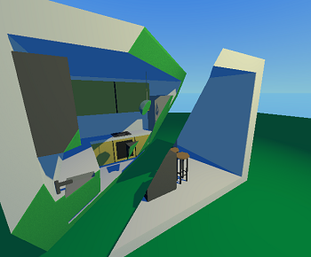
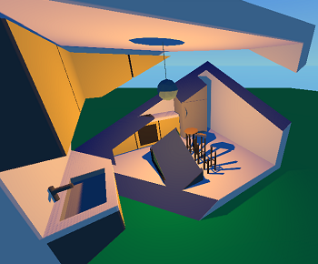

# Godot Stencil Test Project
A test project for the experimental [stencil buffer branch](https://github.com/MillionOstrich/godot/tree/stencil-test) in godot. You will need to have downloaded and built the latest commit in the stencil buffer branch to use this project.

# Showcase

 

This project uses the stencil buffer to generate caps for clipped geometry. Caps are generated in real time on the GPU using the stencil buffer. The caps should respond correctly to lighting and shadows, and cast shadows themselves.

This approach requires a model to be closed (i.e. no faces without a corresponding back face) in order to work.

# Demo Model

["Kitchen"](https://poly.google.com/view/b90F1JhGrA4) by ["Poly by Google"](https://poly.google.com/user/4aEd8rQgKu2) is licensed under [CC-BY 3.0](https://creativecommons.org/licenses/by/3.0). 
 
 See also:
 - license.txt in the model folder
 - https://support.google.com/poly/answer/7418679